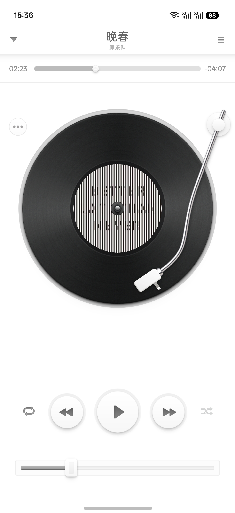
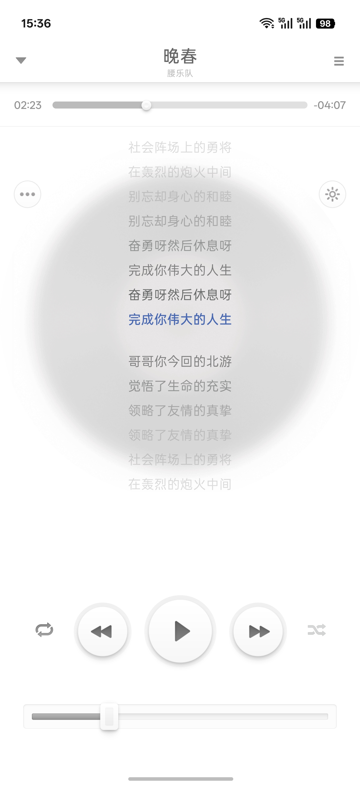
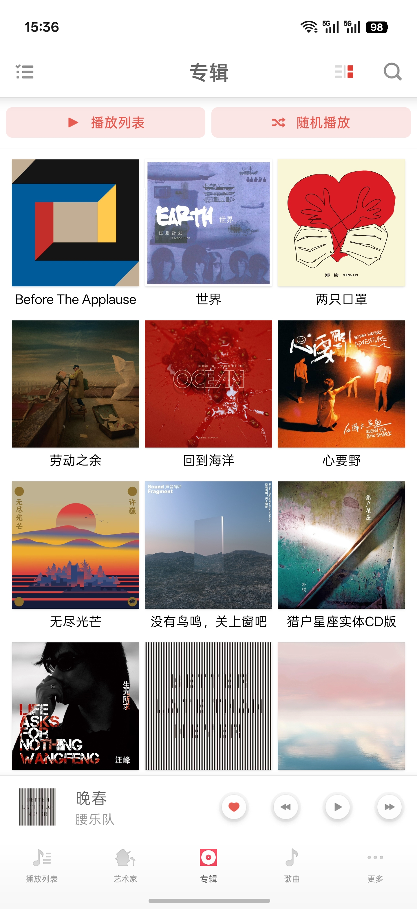

<p align="center">
  
</p>

<h1 align="center">Smartisan Music Revived</h1>

<p align="center">
  <a href="https://kotlinlang.org"></a>
  <a href="https://developer.android.com/build"></a>
  <a href="https://developer.android.com/about/versions/oreo/android-8.1"></a>
  <a href="https://developer.android.com/media/media3"></a>
</p>

<p align="center">
  <a href="README.md">中文</a> · English
</p>

Smartisan never saw itself as a company concerned with visuals alone. A beautiful interface was only the beginning; a product still had to solve real problems. Design, functionality, and interaction were meant to feel coherent—easy to understand on first use, yet rich enough to reveal small surprises over time. The “artisan” in Smartisan was not about placing a polished skin over a product, but about caring for every touch, response, and pause.

Smartisan Music is one of the clearest expressions of that idea. Its turntable, tonearm, scratching, and vinyl crackle make digital music feel tangible, while songs, albums, and the library remain calm and legible. The physical playfulness should never come at the expense of playback or organization; what deserves to be preserved is the balance between texture, order, and utility.

Smartisan OS has left the stage, so this project uses Smartisan Music 8.1.0 as its visual and interaction reference and rebuilds it with a modern Android stack. The interface retains the original XML layouts, drawables, NinePatch assets, selectors, animation timing, and view hierarchy wherever practical. Media scanning, background playback, queues, favorites, playlists, and persistence are rebuilt entirely on public Android APIs. The app reads and plays audio stored on the device and contains no built-in content catalog, account system, or media distribution service.

## Improvements over the original

- **Modern local playback architecture**: Media3 `MediaLibraryService`, ExoPlayer, and MediaSession power background and lock-screen playback, media notifications, headset and Bluetooth controls, and queue and position recovery after process restarts.
- **Rebuilt local library**: MediaStore indexes songs and provides song, album, artist, genre, and folder views, along with library exclusions, rescanning, sorting, filtering, and an alphabetical sidebar.
- **Rebuilt favorites and playlists**: The original favorites and user-created playlists are retained, with persistence and play statistics reimplemented in Room. The queue, current item, and playback position are saved and restored as well.
- **Expanded playback screen**: Embedded lyrics, a sleep timer, and a reorderable queue complement the original turntable and controls.
- **New personalization options**: Custom artist separators, reorderable and pinnable bottom navigation, switchable app icons, and lightweight sound effects are added. Alongside the original icon, the yellow vinyl icon from realme UI 7.0 Music is preserved with color and monochrome layers adapted to Android's adaptive-icon specification. Sound effects include several presets and a custom equalizer curve.
- **Refined turntable interaction**: Tonearm dragging, vinyl rotation, scratching, crackle audio, and playback-state transitions are reimplemented for modern touch handling, lifecycles, and frame timing.
- **Richer library actions**: Multi-select, swipe actions, playlist insertion, ringtone assignment, and version-appropriate MediaStore deletion authorization are supported. Audio can also be opened directly from file managers and other apps.
- **Android 8.1 and later support**: Separate compatibility paths cover legacy and scoped storage, system bars, gesture navigation, display cutouts, WindowInsets, and predictive back without replacing the original visual language.
- **Modern data architecture**: Room, DataStore, Coroutines, and StateFlow manage the library, favorites, playlists, settings, and playback state without private Smartisan OS services or system-signature capabilities.
- **Removed legacy baggage**: Business code is written in Kotlin and retains only the resources and public APIs required by the current implementation. The original background services, databases, and settings migrations are not carried forward.

## Current features

- Local audio permission flow, scanning, reindexing, and library folder exclusions
- Song, album, artist, genre, and folder browsing
- Sorting, filtering, alphabetical navigation, multi-select, and swipe actions
- Favorites, user-created playlists, and play statistics
- Background playback, media notifications, and headset and Bluetooth controls
- Sequential, shuffle, repeat-one, and repeat-all playback modes
- Expandable queue, drag-to-reorder, and queue and position recovery
- Vinyl turntable, draggable tonearm, scratching, and crackle audio
- Static, line-synchronized, and word-timed lyrics embedded in audio files
- Original, Bass, Clear, Vocal, Rock, and custom sound profiles
- Sleep timer, system music volume control, and ringtone assignment
- External audio opening and MediaStore-backed media deletion
- Custom artist separators, bottom-navigation order and pinned items, and switchable app icons

## Local media and permissions

The final app manifest does not contain the `INTERNET` permission. The app does not depend on a network connection and does not upload songs, artwork, lyrics, or library metadata.

- Android 13 and later use `READ_MEDIA_AUDIO` to read device audio. Android 8.1 through Android 12 use the version-limited `READ_EXTERNAL_STORAGE` permission.
- `FOREGROUND_SERVICE_MEDIA_PLAYBACK` is used only to keep user-initiated playback and its media notification active in the background.
- `MODIFY_AUDIO_SETTINGS` supports playback effects and system music volume control, while `VIBRATE` provides interaction feedback.
- `WRITE_SETTINGS` is used only when the user explicitly chooses “Set ringtone.” The app opens the system authorization screen first and cannot modify system settings without explicit approval.
- For song deletion, Android 11 and later use the system batch confirmation flow, while Android 10 grants access per file. Android 8.1 and Android 9 request `WRITE_EXTERNAL_STORAGE` only after the user confirms deletion, then delete through MediaStore.
- The app does not request location, camera, microphone, contacts, SMS, overlay, or accessibility permissions.

## Screenshots

<p align="center">
  
  
  
</p>

Album artwork, artist information, and music content visible in screenshots remain the property of their respective rights holders and are shown only to demonstrate the interface.

## Tech stack

| Category | Technology |
| --- | --- |
| Build | Android Gradle Plugin `9.2.1`, Gradle `9.4.1`, JDK 21 (Java 11 bytecode) |
| Language | Kotlin `2.4.0` |
| UI | XML layouts, Android View, custom View, Jetpack Compose |
| Playback | Media3 `1.10.1`, ExoPlayer, MediaLibraryService, MediaSession |
| State | Lifecycle, StateFlow, Coroutines |
| Storage | Room `2.8.4`, DataStore `1.2.1`, MediaStore |
| SDK | `minSdk 27` / `targetSdk 36` / `compileSdk 37` |

## Build

Install JDK 21 and the Android SDK, then run:

```bash
./gradlew testDebugUnitTest assembleDebug lintDebug
```

The debug APK is written to `app/build/outputs/apk/debug/`.

To verify the minified release build, run:

```bash
./gradlew assembleRelease
```

The release APK is written to `app/build/outputs/apk/release/SmartisanMusic-Revived-0.1.0.apk`.

## Acknowledgments

Thanks to [People-11](https://github.com/People-11/) for [SmartisanOS_APP_Port](https://github.com/People-11/SmartisanOS_APP_Port/). This project used its `Music_8.1.0.apk` as a reverse-engineering reference for original resources, page hierarchy, visual details, animation timing, and interaction behavior.

People-11's work allows the original app to continue running on non-Smartisan devices. This project instead rebuilds media scanning, playback services, the library, queues, and persistence, using modern public Android APIs for system integration while preserving the original design language.

## Disclaimer

This project is not affiliated with ByteDance, Smartisan Technology, realme, OPPO, or any rights holder associated with their products. It is an unofficial recreation driven by personal interest.

- Smartisan OS, related trademarks, visual designs, and original assets remain the intellectual property of their respective rights holders.
- The optional yellow vinyl icon is sourced from the default realme UI 7.0 UXIcon resources and is included solely for visual preservation and homage. Its artwork and related rights remain with their original rights holders and are not relicensed under this project's license. See `THIRD_PARTY_NOTICES.md` for provenance and file hashes.
- This project provides no music content. Users are responsible for ensuring that audio stored on their devices is obtained and used in accordance with applicable law and rights-holder requirements.
